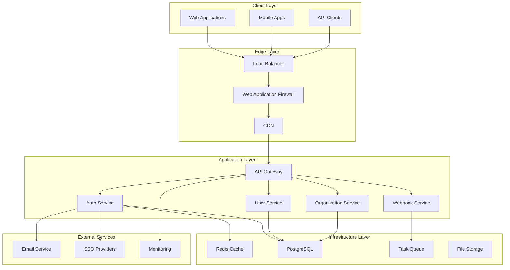
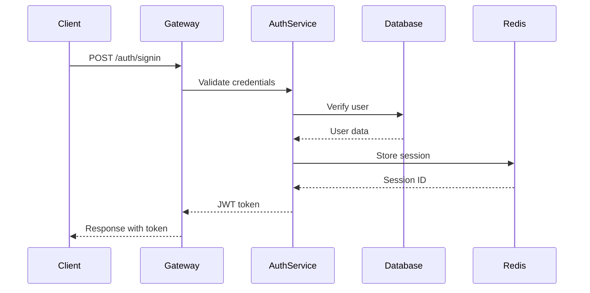
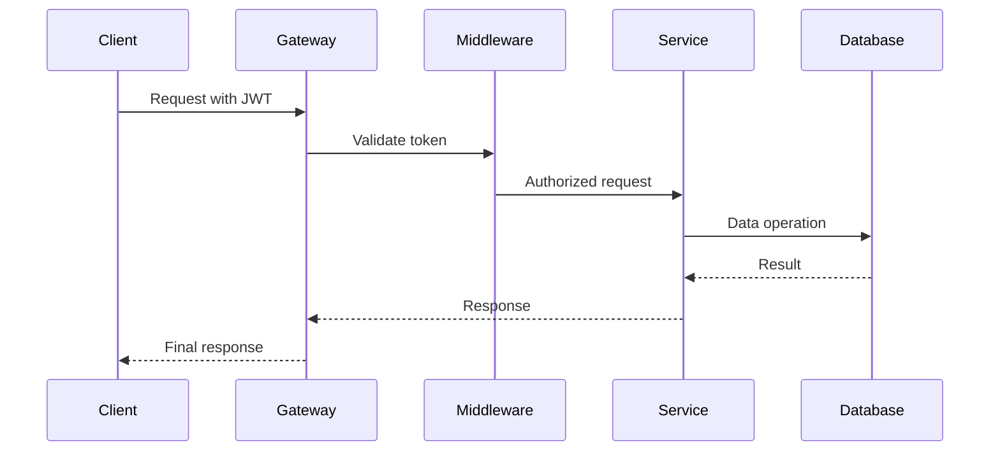

# Architecture Documentation

> **System design, patterns, and technical decisions for the Plinto API**

This section provides comprehensive architectural documentation for the Plinto authentication platform, including system design, technology choices, and implementation patterns.

## 🏗️ Architecture Overview

### System Architecture



### Key Architectural Principles

#### 1. **Async-First Design**
- **Principle**: Maximize concurrency through async/await patterns
- **Implementation**: FastAPI with async handlers, async database operations
- **Benefits**: High throughput, efficient resource utilization
- **Trade-offs**: Complexity in debugging, testing async code

#### 2. **Domain-Driven Design**
- **Principle**: Organize code around business domains
- **Implementation**: Service layer separation, domain models
- **Benefits**: Clear ownership, maintainable codebase
- **Trade-offs**: Additional abstraction layers

#### 3. **Security by Design**
- **Principle**: Security considerations at every architectural layer
- **Implementation**: Zero-trust networking, defense in depth
- **Benefits**: Comprehensive security posture
- **Trade-offs**: Additional complexity, performance overhead

#### 4. **Scalability Patterns**
- **Principle**: Design for horizontal scaling from day one
- **Implementation**: Stateless services, external session storage
- **Benefits**: Elastic scaling, high availability
- **Trade-offs**: Distributed system complexity

## 📋 Technology Stack

### Core Technologies

| Component | Technology | Version | Purpose | Documentation |
|-----------|------------|---------|---------|---------------|
| **Web Framework** | FastAPI | 0.104.1 | Async HTTP framework | [FastAPI Patterns](fastapi-patterns.md) |
| **Database** | PostgreSQL | 14+ | Primary data store | [Database Design](database-design.md) |
| **Cache** | Redis | 6+ | Caching, sessions | [Caching Strategy](caching-strategy.md) |
| **ORM** | SQLAlchemy | 2.0 | Database abstraction | [Database Patterns](database-patterns.md) |
| **Validation** | Pydantic | 2.11 | Data validation | [Validation Patterns](validation-patterns.md) |
| **Testing** | Pytest | 7+ | Test framework | [Testing Architecture](testing-architecture.md) |

### Infrastructure Technologies

| Component | Technology | Purpose | Documentation |
|-----------|------------|---------|---------------|
| **Containerization** | Docker | Application packaging | [Container Strategy](container-strategy.md) |
| **Orchestration** | Kubernetes | Container orchestration | [K8s Architecture](kubernetes-architecture.md) |
| **Monitoring** | Prometheus + Grafana | Metrics and alerting | [Monitoring Architecture](monitoring-architecture.md) |
| **Logging** | Structured Logging | Centralized logging | [Logging Strategy](logging-strategy.md) |
| **CI/CD** | GitHub Actions | Automated deployment | [Deployment Pipeline](deployment-pipeline.md) |

## 🏛️ Architectural Patterns

### 1. Layered Architecture

```
┌─────────────────────────────────────────┐
│             Presentation Layer          │  ← FastAPI Routers
├─────────────────────────────────────────┤
│             Application Layer           │  ← Business Services
├─────────────────────────────────────────┤
│              Domain Layer               │  ← Domain Models
├─────────────────────────────────────────┤
│            Infrastructure Layer         │  ← Database, External APIs
└─────────────────────────────────────────┘
```

**Benefits**:
- Clear separation of concerns
- Testable business logic
- Maintainable codebase

**Implementation**:
- Routers handle HTTP concerns
- Services contain business logic
- Models represent domain entities
- Infrastructure handles external dependencies

### 2. Dependency Injection

```python
# Service registration
@lru_cache()
def get_user_service() -> UserService:
    return UserService(
        repository=get_user_repository(),
        email_service=get_email_service()
    )

# Router dependency
@router.post("/users")
async def create_user(
    user_data: UserCreate,
    user_service: UserService = Depends(get_user_service)
):
    return await user_service.create_user(user_data)
```

**Benefits**:
- Loose coupling
- Easy testing with mocks
- Configuration flexibility

### 3. Repository Pattern

```python
class UserRepository:
    async def create(self, user: User) -> User: ...
    async def get_by_id(self, user_id: int) -> Optional[User]: ...
    async def get_by_email(self, email: str) -> Optional[User]: ...
    async def update(self, user: User) -> User: ...
    async def delete(self, user_id: int) -> None: ...

class UserService:
    def __init__(self, repository: UserRepository):
        self.repository = repository

    async def create_user(self, user_data: UserCreate) -> User:
        # Business logic here
        return await self.repository.create(user)
```

**Benefits**:
- Data access abstraction
- Testable with mock repositories
- Consistent data operations

## 🔄 Request Flow Architecture

### 1. Authentication Flow



### 2. Authorized Request Flow



## 🏢 Multi-Tenancy Architecture

### Tenant Isolation Strategy

```python
class TenantContext:
    def __init__(self, tenant_id: str, user_id: str):
        self.tenant_id = tenant_id
        self.user_id = user_id

class TenantMiddleware:
    async def __call__(self, request: Request, call_next):
        # Extract tenant from JWT or header
        tenant_id = self.extract_tenant(request)

        # Set context for request
        with tenant_context.set(TenantContext(tenant_id, user_id)):
            response = await call_next(request)

        return response
```

**Isolation Levels**:
1. **Row-Level Security**: PostgreSQL RLS for data isolation
2. **Schema Separation**: Separate schemas per tenant
3. **Database Separation**: Separate databases for enterprise clients

### Multi-Tenant Data Model

```sql
-- All tables include tenant_id for isolation
CREATE TABLE users (
    id SERIAL PRIMARY KEY,
    tenant_id UUID NOT NULL,
    email VARCHAR(255) NOT NULL,
    -- other fields
    UNIQUE(tenant_id, email)
);

-- Row Level Security
ALTER TABLE users ENABLE ROW LEVEL SECURITY;

CREATE POLICY tenant_isolation ON users
    USING (tenant_id = current_setting('app.current_tenant')::UUID);
```

## 🔒 Security Architecture

### Defense in Depth

```
┌─────────────────────────────────────────┐
│              Edge Security              │  ← WAF, DDoS Protection
├─────────────────────────────────────────┤
│           Transport Security            │  ← TLS, HSTS
├─────────────────────────────────────────┤
│         Application Security            │  ← Authentication, Authorization
├─────────────────────────────────────────┤
│             Data Security               │  ← Encryption, Access Control
└─────────────────────────────────────────┘
```

### Authentication Architecture

```python
class AuthenticationService:
    async def authenticate_user(self, email: str, password: str) -> Optional[User]:
        # 1. Rate limiting check
        await self.rate_limiter.check_limit(email)

        # 2. User lookup
        user = await self.user_repository.get_by_email(email)
        if not user or not user.is_active:
            return None

        # 3. Password verification
        if not self.password_service.verify(password, user.password_hash):
            await self.audit_service.log_failed_login(email)
            return None

        # 4. MFA check if enabled
        if user.mfa_enabled:
            # MFA verification required
            return await self.handle_mfa_flow(user)

        # 5. Generate session
        await self.session_service.create_session(user)

        return user
```

## 📊 Performance Architecture

### Caching Strategy

```python
class CachingService:
    def __init__(self):
        self.redis = Redis()
        self.local_cache = LRUCache(maxsize=1000)

    async def get_user(self, user_id: int) -> Optional[User]:
        # L1: Local cache
        if user := self.local_cache.get(f"user:{user_id}"):
            return user

        # L2: Redis cache
        if user_data := await self.redis.get(f"user:{user_id}"):
            user = User.parse_raw(user_data)
            self.local_cache[f"user:{user_id}"] = user
            return user

        # L3: Database
        user = await self.user_repository.get_by_id(user_id)
        if user:
            await self.redis.setex(f"user:{user_id}", 300, user.json())
            self.local_cache[f"user:{user_id}"] = user

        return user
```

### Database Performance

- **Connection Pooling**: Async connection pools for high concurrency
- **Query Optimization**: Indexed queries, query analysis
- **Read Replicas**: Separate read/write operations
- **Partitioning**: Time-based partitioning for audit logs

### Async Architecture Benefits

```python
# Parallel processing example
async def process_user_registration(user_data: UserCreate):
    # Run multiple operations concurrently
    results = await asyncio.gather(
        validate_email_uniqueness(user_data.email),
        check_password_strength(user_data.password),
        verify_organization_domain(user_data.organization),
        return_exceptions=True
    )

    # Handle results
    if any(isinstance(r, Exception) for r in results):
        raise ValidationError("Registration validation failed")
```

## 🔄 Event-Driven Architecture

### Event System

```python
class EventBus:
    def __init__(self):
        self.handlers = defaultdict(list)

    def subscribe(self, event_type: str, handler: Callable):
        self.handlers[event_type].append(handler)

    async def publish(self, event: Event):
        handlers = self.handlers.get(event.type, [])
        await asyncio.gather(*[handler(event) for handler in handlers])

# Event handlers
@event_bus.subscribe("user.created")
async def send_welcome_email(event: UserCreatedEvent):
    await email_service.send_welcome_email(event.user)

@event_bus.subscribe("user.created")
async def update_analytics(event: UserCreatedEvent):
    await analytics_service.track_user_registration(event.user)
```

## 📈 Scalability Architecture

### Horizontal Scaling

- **Stateless Services**: No server-side state, session in Redis
- **Load Balancing**: Round-robin, health check-based routing
- **Auto-scaling**: CPU/memory-based scaling policies
- **Circuit Breakers**: Fault tolerance for external dependencies

### Database Scaling

```python
class DatabaseManager:
    def __init__(self):
        self.write_engine = create_async_engine(WRITE_DB_URL)
        self.read_engines = [
            create_async_engine(READ_replica_url)
            for read_replica_url in READ_REPLICA_URLS
        ]

    async def get_read_session(self):
        # Load balance across read replicas
        engine = random.choice(self.read_engines)
        return async_sessionmaker(engine)

    async def get_write_session(self):
        return async_sessionmaker(self.write_engine)
```

## 🔧 Development Architecture

### Code Organization

```
app/
├── routers/           # HTTP endpoints
│   └── v1/           # API version 1
├── services/         # Business logic
├── models/           # Data models
├── core/             # Infrastructure
├── middleware/       # Custom middleware
└── tests/            # Test suites
```

### Configuration Management

```python
class Settings(BaseSettings):
    # Environment-based configuration
    database_url: str
    redis_url: str
    jwt_secret: str

    class Config:
        env_file = ".env"
        case_sensitive = False

# Dependency injection
@lru_cache()
def get_settings() -> Settings:
    return Settings()
```

## 📚 Related Documentation

- **[Database Design](database-design.md)** - Data modeling and optimization
- **[Security Model](../security/security-model.md)** - Security implementation
- **[Performance Optimization](performance-optimization.md)** - Performance patterns
- **[Deployment Architecture](../deployment/architecture.md)** - Production deployment
- **[Monitoring Strategy](monitoring-architecture.md)** - Observability design

---

<div align="center">

**[⬅️ Documentation Home](../README.md)** • **[🗄️ Database](database-design.md)** • **[🔒 Security](../security/README.md)** • **[🚀 Deployment](../deployment/README.md)**

</div>