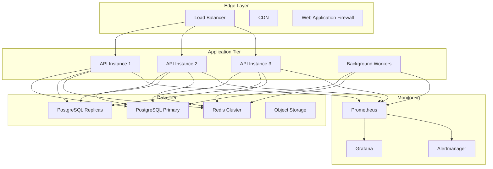

# Deployment Documentation

> **Production-grade deployment strategies and operational guidance for the Janua API**

This section provides comprehensive deployment documentation covering production deployment strategies, infrastructure management, and operational best practices.

## 🚀 Deployment Overview

### Deployment Goals
- **Zero-Downtime Deployments**: Rolling updates with health checks
- **Environment Consistency**: Identical configurations across environments
- **Scalability**: Horizontal scaling based on demand
- **Monitoring**: Comprehensive observability and alerting
- **Security**: Production-hardened security configurations
- **Recovery**: Fast disaster recovery and rollback capabilities

### Supported Deployment Platforms

| Platform | Use Case | Complexity | Documentation |
|----------|----------|------------|---------------|
| **Railway** | Rapid deployment, startups | Low | [Railway Guide](railway.md) |
| **Docker** | Containerized deployment | Medium | [Docker Guide](docker.md) |
| **Kubernetes** | Enterprise, high scale | High | [Kubernetes Guide](kubernetes.md) |
| **Traditional VPS** | Custom infrastructure | Medium | [VPS Guide](traditional-vps.md) |
| **AWS/GCP/Azure** | Cloud-native | Medium-High | [Cloud Providers](cloud-providers.md) |

## 🏗️ Infrastructure Architecture

### Production Architecture



### Infrastructure Requirements

#### Minimum Production Requirements
```yaml
# Minimum production specs
application_servers:
  count: 2
  cpu: 2 cores
  memory: 4GB RAM
  storage: 20GB SSD

database:
  cpu: 4 cores
  memory: 8GB RAM
  storage: 100GB SSD
  backup_storage: 500GB

cache:
  memory: 2GB RAM
  persistence: enabled

monitoring:
  cpu: 2 cores
  memory: 4GB RAM
  storage: 50GB
```

#### Recommended Production Requirements
```yaml
# Recommended production specs
application_servers:
  count: 3
  cpu: 4 cores
  memory: 8GB RAM
  storage: 50GB SSD

database:
  cpu: 8 cores
  memory: 16GB RAM
  storage: 500GB SSD
  backup_storage: 2TB
  replicas: 2

cache:
  memory: 8GB RAM
  cluster_nodes: 3
  persistence: enabled

monitoring:
  cpu: 4 cores
  memory: 8GB RAM
  storage: 200GB
```

## 🐳 Container Deployment

### Docker Configuration

#### Production Dockerfile
```dockerfile
# Multi-stage build for production
FROM python:3.11-slim as builder

# Install build dependencies
RUN apt-get update && apt-get install -y \
    build-essential \
    libpq-dev \
    && rm -rf /var/lib/apt/lists/*

# Create virtual environment
RUN python -m venv /opt/venv
ENV PATH="/opt/venv/bin:$PATH"

# Copy requirements and install dependencies
COPY requirements.txt .
RUN pip install --no-cache-dir -r requirements.txt

# Production stage
FROM python:3.11-slim

# Install runtime dependencies
RUN apt-get update && apt-get install -y \
    libpq5 \
    && rm -rf /var/lib/apt/lists/*

# Copy virtual environment from builder
COPY --from=builder /opt/venv /opt/venv
ENV PATH="/opt/venv/bin:$PATH"

# Create non-root user
RUN useradd --create-home --shell /bin/bash app
USER app
WORKDIR /home/app

# Copy application code
COPY --chown=app:app . .

# Security: Run as non-root
EXPOSE 8000

# Health check
HEALTHCHECK --interval=30s --timeout=30s --start-period=5s --retries=3 \
    CMD curl -f http://localhost:8000/health || exit 1

# Start application
CMD ["uvicorn", "app.main:app", "--host", "0.0.0.0", "--port", "8000", "--workers", "4"]
```

#### Docker Compose for Development
```yaml
# docker-compose.yml
version: '3.8'

services:
  api:
    build: .
    ports:
      - "8000:8000"
    environment:
      - DATABASE_URL=postgresql://postgres:postgres@db:5432/janua
      - REDIS_URL=redis://redis:6379/0
      - ENVIRONMENT=development
    depends_on:
      - db
      - redis
    volumes:
      - .:/app
    command: uvicorn app.main:app --host 0.0.0.0 --port 8000 --reload

  db:
    image: postgres:14
    environment:
      - POSTGRES_DB=janua
      - POSTGRES_USER=postgres
      - POSTGRES_PASSWORD=postgres
    ports:
      - "5432:5432"
    volumes:
      - postgres_data:/var/lib/postgresql/data

  redis:
    image: redis:6-alpine
    ports:
      - "6379:6379"

  prometheus:
    image: prom/prometheus
    ports:
      - "9090:9090"
    volumes:
      - ./monitoring/prometheus.yml:/etc/prometheus/prometheus.yml

volumes:
  postgres_data:
```

## ☸️ Kubernetes Deployment

### Kubernetes Manifests

#### Deployment Configuration
```yaml
# k8s/deployment.yaml
apiVersion: apps/v1
kind: Deployment
metadata:
  name: janua-api
  labels:
    app: janua-api
spec:
  replicas: 3
  selector:
    matchLabels:
      app: janua-api
  template:
    metadata:
      labels:
        app: janua-api
    spec:
      containers:
      - name: api
        image: janua/api:latest
        ports:
        - containerPort: 8000
        env:
        - name: DATABASE_URL
          valueFrom:
            secretKeyRef:
              name: janua-secrets
              key: database-url
        - name: REDIS_URL
          valueFrom:
            secretKeyRef:
              name: janua-secrets
              key: redis-url
        - name: JWT_SECRET_KEY
          valueFrom:
            secretKeyRef:
              name: janua-secrets
              key: jwt-secret
        resources:
          requests:
            memory: "512Mi"
            cpu: "250m"
          limits:
            memory: "1Gi"
            cpu: "500m"
        livenessProbe:
          httpGet:
            path: /health
            port: 8000
          initialDelaySeconds: 30
          periodSeconds: 10
        readinessProbe:
          httpGet:
            path: /ready
            port: 8000
          initialDelaySeconds: 5
          periodSeconds: 5
      imagePullSecrets:
      - name: regcred
```

#### Service Configuration
```yaml
# k8s/service.yaml
apiVersion: v1
kind: Service
metadata:
  name: janua-api-service
spec:
  selector:
    app: janua-api
  ports:
  - protocol: TCP
    port: 80
    targetPort: 8000
  type: ClusterIP
```

#### Ingress Configuration
```yaml
# k8s/ingress.yaml
apiVersion: networking.k8s.io/v1
kind: Ingress
metadata:
  name: janua-api-ingress
  annotations:
    kubernetes.io/ingress.class: "nginx"
    cert-manager.io/cluster-issuer: "letsencrypt-prod"
    nginx.ingress.kubernetes.io/ssl-redirect: "true"
    nginx.ingress.kubernetes.io/force-ssl-redirect: "true"
spec:
  tls:
  - hosts:
    - api.janua.dev
    secretName: janua-api-tls
  rules:
  - host: api.janua.dev
    http:
      paths:
      - path: /
        pathType: Prefix
        backend:
          service:
            name: janua-api-service
            port:
              number: 80
```

### Helm Chart

```yaml
# helm/values.yaml
replicaCount: 3

image:
  repository: janua/api
  tag: latest
  pullPolicy: IfNotPresent

service:
  type: ClusterIP
  port: 80

ingress:
  enabled: true
  className: "nginx"
  annotations:
    cert-manager.io/cluster-issuer: letsencrypt-prod
  hosts:
    - host: api.janua.dev
      paths:
        - path: /
          pathType: Prefix
  tls:
    - secretName: janua-api-tls
      hosts:
        - api.janua.dev

resources:
  limits:
    cpu: 500m
    memory: 1Gi
  requests:
    cpu: 250m
    memory: 512Mi

autoscaling:
  enabled: true
  minReplicas: 3
  maxReplicas: 10
  targetCPUUtilizationPercentage: 80

postgresql:
  enabled: true
  auth:
    postgresPassword: "secure-password"
    database: "janua"
  primary:
    persistence:
      enabled: true
      size: 100Gi

redis:
  enabled: true
  auth:
    enabled: true
    password: "secure-redis-password"
  master:
    persistence:
      enabled: true
      size: 8Gi
```

## 🌐 Cloud Provider Deployment

### AWS Deployment

#### ECS Fargate Configuration
```json
{
  "family": "janua-api",
  "networkMode": "awsvpc",
  "requiresCompatibilities": ["FARGATE"],
  "cpu": "1024",
  "memory": "2048",
  "executionRoleArn": "arn:aws:iam::account:role/ecsTaskExecutionRole",
  "taskRoleArn": "arn:aws:iam::account:role/ecsTaskRole",
  "containerDefinitions": [
    {
      "name": "janua-api",
      "image": "your-account.dkr.ecr.region.amazonaws.com/janua-api:latest",
      "portMappings": [
        {
          "containerPort": 8000,
          "protocol": "tcp"
        }
      ],
      "environment": [
        {
          "name": "ENVIRONMENT",
          "value": "production"
        }
      ],
      "secrets": [
        {
          "name": "DATABASE_URL",
          "valueFrom": "arn:aws:ssm:region:account:parameter/janua/database-url"
        }
      ],
      "logConfiguration": {
        "logDriver": "awslogs",
        "options": {
          "awslogs-group": "/ecs/janua-api",
          "awslogs-region": "us-east-1",
          "awslogs-stream-prefix": "ecs"
        }
      },
      "healthCheck": {
        "command": ["CMD-SHELL", "curl -f http://localhost:8000/health || exit 1"],
        "interval": 30,
        "timeout": 5,
        "retries": 3
      }
    }
  ]
}
```

#### Terraform Configuration
```hcl
# terraform/main.tf
provider "aws" {
  region = var.aws_region
}

# ECS Cluster
resource "aws_ecs_cluster" "main" {
  name = "janua-cluster"

  setting {
    name  = "containerInsights"
    value = "enabled"
  }
}

# Application Load Balancer
resource "aws_lb" "main" {
  name               = "janua-alb"
  internal           = false
  load_balancer_type = "application"
  security_groups    = [aws_security_group.lb.id]
  subnets            = aws_subnet.public[*].id

  enable_deletion_protection = true
}

# RDS Instance
resource "aws_db_instance" "main" {
  identifier     = "janua-db"
  engine         = "postgres"
  engine_version = "14.9"
  instance_class = "db.t3.medium"

  allocated_storage     = 100
  max_allocated_storage = 1000
  storage_encrypted     = true

  db_name  = "janua"
  username = "postgres"
  password = var.db_password

  vpc_security_group_ids = [aws_security_group.rds.id]
  db_subnet_group_name   = aws_db_subnet_group.main.name

  backup_retention_period = 7
  backup_window          = "03:00-04:00"
  maintenance_window     = "sun:04:00-sun:05:00"

  skip_final_snapshot = false
  final_snapshot_identifier = "janua-db-final-snapshot"
}

# ElastiCache Redis
resource "aws_elasticache_replication_group" "main" {
  replication_group_id       = "janua-redis"
  description                = "Redis cluster for Janua API"

  port                       = 6379
  parameter_group_name       = "default.redis6.x"
  node_type                  = "cache.t3.micro"
  num_cache_clusters         = 2

  subnet_group_name          = aws_elasticache_subnet_group.main.name
  security_group_ids         = [aws_security_group.redis.id]

  at_rest_encryption_enabled = true
  transit_encryption_enabled = true
  auth_token                 = var.redis_auth_token
}
```

## 📊 Monitoring & Observability

### Prometheus Configuration

```yaml
# monitoring/prometheus.yml
global:
  scrape_interval: 15s
  evaluation_interval: 15s

rule_files:
  - "janua_rules.yml"

alerting:
  alertmanagers:
    - static_configs:
        - targets:
          - alertmanager:9093

scrape_configs:
  - job_name: 'janua-api'
    static_configs:
      - targets: ['api:8000']
    metrics_path: '/metrics'
    scrape_interval: 10s

  - job_name: 'postgresql'
    static_configs:
      - targets: ['postgres-exporter:9187']

  - job_name: 'redis'
    static_configs:
      - targets: ['redis-exporter:9121']

  - job_name: 'node'
    static_configs:
      - targets: ['node-exporter:9100']
```

### Grafana Dashboards

```json
{
  "dashboard": {
    "title": "Janua API Dashboard",
    "panels": [
      {
        "title": "Request Rate",
        "type": "graph",
        "targets": [
          {
            "expr": "rate(http_requests_total[5m])",
            "legendFormat": "{{method}} {{endpoint}}"
          }
        ]
      },
      {
        "title": "Response Time",
        "type": "graph",
        "targets": [
          {
            "expr": "histogram_quantile(0.95, rate(http_request_duration_seconds_bucket[5m]))",
            "legendFormat": "95th percentile"
          }
        ]
      },
      {
        "title": "Error Rate",
        "type": "singlestat",
        "targets": [
          {
            "expr": "rate(http_requests_total{status=~\"5..\"}[5m]) / rate(http_requests_total[5m]) * 100"
          }
        ]
      }
    ]
  }
}
```

## 🔄 CI/CD Pipeline

### GitHub Actions Workflow

```yaml
# .github/workflows/deploy.yml
name: Deploy to Production

on:
  push:
    branches: [main]

jobs:
  test:
    runs-on: ubuntu-latest
    services:
      postgres:
        image: postgres:14
        env:
          POSTGRES_PASSWORD: postgres
        options: >-
          --health-cmd pg_isready
          --health-interval 10s
          --health-timeout 5s
          --health-retries 5

    steps:
    - uses: actions/checkout@v3

    - name: Set up Python
      uses: actions/setup-python@v4
      with:
        python-version: '3.11'

    - name: Install dependencies
      run: |
        pip install -r requirements.txt
        pip install -r requirements-test.txt

    - name: Run tests
      run: pytest --cov=app --cov-report=xml

    - name: Security scan
      run: bandit -r app/

  build:
    needs: test
    runs-on: ubuntu-latest

    steps:
    - uses: actions/checkout@v3

    - name: Build Docker image
      run: |
        docker build -t janua/api:${{ github.sha }} .
        docker tag janua/api:${{ github.sha }} janua/api:latest

    - name: Push to registry
      run: |
        echo ${{ secrets.DOCKER_PASSWORD }} | docker login -u ${{ secrets.DOCKER_USERNAME }} --password-stdin
        docker push janua/api:${{ github.sha }}
        docker push janua/api:latest

  deploy:
    needs: build
    runs-on: ubuntu-latest
    environment: production

    steps:
    - name: Deploy to Kubernetes
      run: |
        kubectl set image deployment/janua-api api=janua/api:${{ github.sha }}
        kubectl rollout status deployment/janua-api
```

## 🛡️ Production Security

### Security Hardening Checklist

- [ ] **TLS Configuration**
  - [ ] TLS 1.3 enabled
  - [ ] Strong cipher suites
  - [ ] Certificate pinning (mobile)
  - [ ] HSTS headers configured

- [ ] **Application Security**
  - [ ] Environment variables secured
  - [ ] Secrets management configured
  - [ ] Rate limiting enabled
  - [ ] Security headers configured

- [ ] **Infrastructure Security**
  - [ ] Network segmentation
  - [ ] Firewall rules configured
  - [ ] VPN/bastion access only
  - [ ] Regular security updates

- [ ] **Database Security**
  - [ ] Encryption at rest enabled
  - [ ] Network isolation
  - [ ] Regular backups encrypted
  - [ ] Access logging enabled

### Environment Variables Security

```bash
# Production environment variables
export ENVIRONMENT=production
export DATABASE_URL="postgresql://..."  # From secrets manager
export REDIS_URL="redis://..."          # From secrets manager
export JWT_SECRET_KEY="..."             # Cryptographically secure
export SECRET_KEY="..."                 # Cryptographically secure

# Feature flags
export ENABLE_DOCS=false                # Disable in production
export ENABLE_DEBUG=false               # Never enable in production
export RATE_LIMIT_ENABLED=true          # Always enable

# Monitoring
export SENTRY_DSN="..."                 # Error tracking
export MONITORING_ENDPOINT="..."        # Metrics endpoint
```

## 📋 Deployment Checklist

### Pre-Deployment Checklist
- [ ] All tests passing
- [ ] Security scan completed
- [ ] Performance tests completed
- [ ] Database migrations tested
- [ ] Configuration validated
- [ ] Rollback plan prepared

### Post-Deployment Checklist
- [ ] Health checks passing
- [ ] Monitoring alerts configured
- [ ] Performance metrics baseline
- [ ] Security monitoring active
- [ ] Documentation updated
- [ ] Team notified

## 🆘 Troubleshooting

### Common Deployment Issues

#### Database Connection Issues
```bash
# Check database connectivity
kubectl exec -it deployment/janua-api -- python -c "
import asyncpg
import asyncio

async def test_db():
    conn = await asyncpg.connect('postgresql://...')
    result = await conn.fetchval('SELECT 1')
    print(f'Database test: {result}')
    await conn.close()

asyncio.run(test_db())
"
```

#### Redis Connection Issues
```bash
# Check Redis connectivity
kubectl exec -it deployment/janua-api -- python -c "
import redis
r = redis.from_url('redis://...')
print(f'Redis ping: {r.ping()}')
"
```

## 📚 Related Documentation

- **[Production Operations](operations.md)** - Day-to-day operations
- **[Monitoring Guide](monitoring.md)** - Comprehensive monitoring setup
- **[Backup & Recovery](backup-recovery.md)** - Data protection strategies
- **[Performance Tuning](performance-tuning.md)** - Optimization techniques
- **[Security Hardening](security-hardening.md)** - Production security

---

<div align="center">

**[⬅️ Documentation Home](../README.md)** • **[🐳 Docker](docker.md)** • **[☸️ Kubernetes](kubernetes.md)** • **[📊 Monitoring](monitoring.md)**

</div>