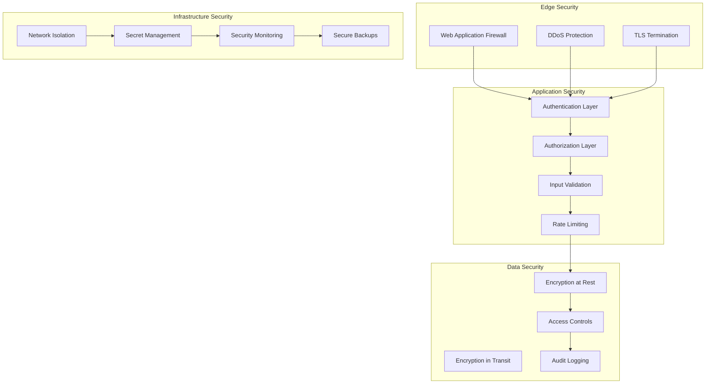

# Security Documentation

> **Comprehensive security implementation and compliance for the Janua API**

This section provides detailed security documentation covering implementation, compliance frameworks, and security best practices for the Janua authentication platform.

## 🛡️ Security Overview

### Security Mission
Janua is designed with security as a foundational principle, implementing defense-in-depth strategies to protect user data, ensure privacy, and maintain service integrity across all components.

### Security Objectives
- **Confidentiality**: Protect sensitive data through encryption and access controls
- **Integrity**: Ensure data accuracy and prevent unauthorized modifications
- **Availability**: Maintain service reliability and prevent service disruption
- **Accountability**: Comprehensive audit logging and traceability
- **Compliance**: Meet regulatory requirements (SOC 2, GDPR, HIPAA-ready)

### Security Architecture



## 🔐 Authentication & Authorization

### Authentication Methods

| Method | Use Case | Security Level | Documentation |
|--------|----------|----------------|---------------|
| **JWT Tokens** | API access, web apps | High | [JWT Implementation](jwt-security.md) |
| **WebAuthn/Passkeys** | Passwordless auth | Very High | [WebAuthn Security](webauthn-security.md) |
| **Multi-Factor Auth** | Enhanced security | Very High | [MFA Implementation](mfa-security.md) |
| **API Keys** | Service-to-service | Medium | [API Key Security](api-key-security.md) |
| **OAuth 2.0/OIDC** | Third-party integrations | High | [OAuth Security](oauth-security.md) |

### Authorization Framework

```python
class RoleBasedAccessControl:
    """RBAC implementation with fine-grained permissions"""

    def __init__(self):
        self.permissions = {
            'admin': ['*'],  # All permissions
            'org_admin': ['org:*', 'user:read', 'user:update'],
            'user': ['user:read', 'user:update_own'],
            'viewer': ['user:read_own']
        }

    async def check_permission(self, user: User, resource: str, action: str) -> bool:
        """Check if user has permission for action on resource"""
        required_permission = f"{resource}:{action}"
        user_permissions = self.get_user_permissions(user)

        return (
            '*' in user_permissions or
            required_permission in user_permissions or
            f"{resource}:*" in user_permissions
        )
```

### Security Token Management

#### JWT Security Configuration
```python
JWT_SETTINGS = {
    'algorithm': 'RS256',  # Asymmetric signing
    'access_token_expire_minutes': 15,  # Short-lived access tokens
    'refresh_token_expire_days': 7,     # Medium-lived refresh tokens
    'issuer': 'https://janua.dev',
    'audience': 'janua-api',
    'key_rotation_interval': 30,       # Days
}
```

#### Token Rotation Strategy
- **Access Tokens**: 15-minute expiry, stateless verification
- **Refresh Tokens**: 7-day expiry, stored in Redis with rotation
- **Key Rotation**: Automatic RSA key rotation every 30 days
- **Revocation**: Real-time token revocation via Redis blacklist

## 🔒 Data Protection

### Encryption Standards

#### Encryption at Rest
```python
class DataEncryption:
    """AES-256-GCM encryption for sensitive data"""

    def __init__(self, encryption_key: bytes):
        self.fernet = Fernet(encryption_key)

    def encrypt_pii(self, data: str) -> str:
        """Encrypt personally identifiable information"""
        return self.fernet.encrypt(data.encode()).decode()

    def decrypt_pii(self, encrypted_data: str) -> str:
        """Decrypt PII data"""
        return self.fernet.decrypt(encrypted_data.encode()).decode()

# Database column encryption
class User(Base):
    id = Column(Integer, primary_key=True)
    email = Column(String, nullable=False)  # Hashed for lookups
    phone = Column(EncryptedType(String, secret_key))  # Encrypted
    ssn = Column(EncryptedType(String, secret_key))    # Encrypted
```

#### Encryption in Transit
- **TLS 1.3**: All external communications
- **Certificate Pinning**: Mobile applications
- **HSTS**: Strict transport security headers
- **Perfect Forward Secrecy**: Ephemeral key exchange

### Data Classification

| Level | Examples | Protection |
|-------|----------|------------|
| **Public** | Public profiles, documentation | Standard HTTPS |
| **Internal** | System metadata, logs | TLS + access controls |
| **Confidential** | User emails, preferences | TLS + encryption + audit |
| **Restricted** | Passwords, PII, financial | TLS + encryption + strict access |

### Password Security

```python
class PasswordSecurity:
    """Comprehensive password security implementation"""

    def __init__(self):
        self.pwd_context = CryptContext(
            schemes=['bcrypt'],
            deprecated='auto',
            bcrypt__rounds=12  # High cost factor
        )

    def hash_password(self, password: str) -> str:
        """Hash password with bcrypt and salt"""
        return self.pwd_context.hash(password)

    def verify_password(self, password: str, hash: str) -> bool:
        """Verify password against hash"""
        return self.pwd_context.verify(password, hash)

    def validate_strength(self, password: str) -> PasswordStrength:
        """Validate password strength"""
        return PasswordValidator().validate(password)
```

#### Password Policy
- **Minimum Length**: 12 characters
- **Complexity**: Uppercase, lowercase, numbers, symbols
- **Breach Check**: Integration with HaveIBeenPwned API
- **History**: Prevent reuse of last 12 passwords
- **Expiration**: Optional 90-day expiration for high-security orgs

## 🔍 Security Monitoring

### Audit Logging

```python
class AuditLogger:
    """Comprehensive audit logging for security events"""

    async def log_security_event(
        self,
        event_type: str,
        user_id: Optional[int],
        details: Dict[str, Any],
        severity: str = 'INFO'
    ):
        """Log security-relevant events"""
        audit_entry = AuditLog(
            event_type=event_type,
            user_id=user_id,
            ip_address=self.get_client_ip(),
            user_agent=self.get_user_agent(),
            details=details,
            severity=severity,
            timestamp=datetime.utcnow()
        )

        await self.audit_repository.create(audit_entry)

        # Real-time alerting for high-severity events
        if severity in ['CRITICAL', 'HIGH']:
            await self.alert_service.send_security_alert(audit_entry)
```

#### Audit Event Types
- **Authentication**: Login, logout, MFA events
- **Authorization**: Permission grants, denials
- **Data Access**: Sensitive data reads, modifications
- **Administrative**: User management, configuration changes
- **Security**: Failed logins, suspicious activity

### Threat Detection

```python
class ThreatDetection:
    """Real-time threat detection and response"""

    async def analyze_login_attempt(self, login_event: LoginEvent):
        """Analyze login for suspicious patterns"""
        risk_score = 0

        # Geographic anomaly detection
        if await self.is_unusual_location(login_event.user_id, login_event.ip):
            risk_score += 30

        # Device fingerprinting
        if await self.is_new_device(login_event.user_id, login_event.device_id):
            risk_score += 20

        # Time-based analysis
        if await self.is_unusual_time(login_event.user_id, login_event.timestamp):
            risk_score += 15

        # Respond based on risk level
        if risk_score >= 50:
            await self.require_additional_verification(login_event)
        elif risk_score >= 30:
            await self.send_security_notification(login_event)
```

## 🚨 Incident Response

### Security Incident Classification

| Severity | Description | Response Time | Examples |
|----------|-------------|---------------|----------|
| **Critical** | Active breach, data compromise | < 15 minutes | Database breach, API compromise |
| **High** | Potential breach, service impact | < 1 hour | DDoS attack, authentication bypass |
| **Medium** | Security policy violation | < 4 hours | Failed compliance check, misc config |
| **Low** | Information gathering, reconnaissance | < 24 hours | Port scans, enum attempts |

### Incident Response Workflow

```python
class IncidentResponse:
    """Automated incident response system"""

    async def handle_security_incident(self, incident: SecurityIncident):
        """Orchestrate incident response based on severity"""

        # Immediate containment
        if incident.severity == 'CRITICAL':
            await self.emergency_lockdown(incident)

        # Notification and escalation
        await self.notify_security_team(incident)

        # Evidence collection
        await self.collect_evidence(incident)

        # Automated remediation
        if incident.can_auto_remediate:
            await self.auto_remediate(incident)

        # Documentation
        await self.create_incident_report(incident)
```

## 📋 Compliance Framework

### Regulatory Compliance

#### SOC 2 Type II Compliance
- **Security**: Access controls, encryption, monitoring
- **Availability**: Uptime, disaster recovery, redundancy
- **Processing Integrity**: Data accuracy, completeness
- **Confidentiality**: Data classification, access restrictions
- **Privacy**: PII protection, consent management

#### GDPR Compliance
```python
class GDPRCompliance:
    """GDPR compliance implementation"""

    async def handle_data_subject_request(self, request: DataSubjectRequest):
        """Process GDPR data subject requests"""

        match request.type:
            case 'ACCESS':
                return await self.export_user_data(request.user_id)
            case 'RECTIFICATION':
                return await self.update_user_data(request.user_id, request.data)
            case 'ERASURE':
                return await self.delete_user_data(request.user_id)
            case 'PORTABILITY':
                return await self.export_portable_data(request.user_id)
            case 'OBJECTION':
                return await self.stop_processing(request.user_id, request.purpose)
```

#### HIPAA Readiness
- **Access Controls**: Role-based access, minimum necessary principle
- **Audit Controls**: Comprehensive logging and monitoring
- **Integrity**: Data integrity controls and validation
- **Transmission Security**: End-to-end encryption

### Compliance Monitoring

```python
class ComplianceMonitor:
    """Continuous compliance monitoring"""

    async def run_compliance_checks(self):
        """Execute automated compliance validation"""

        checks = [
            self.check_encryption_compliance(),
            self.check_access_control_compliance(),
            self.check_audit_log_compliance(),
            self.check_data_retention_compliance(),
            self.check_security_policy_compliance()
        ]

        results = await asyncio.gather(*checks)

        # Generate compliance report
        report = ComplianceReport(
            timestamp=datetime.utcnow(),
            checks=results,
            overall_status=self.calculate_overall_status(results)
        )

        await self.store_compliance_report(report)

        # Alert on non-compliance
        if report.overall_status != 'COMPLIANT':
            await self.alert_compliance_team(report)
```

## 🔧 Security Configuration

### Environment-Specific Security

#### Development Environment
```yaml
# Development security settings
security:
  require_https: false
  jwt_algorithm: 'HS256'  # Simpler for dev
  session_timeout: 24h
  rate_limits:
    login: 10/minute
    api: 100/minute
  audit_level: 'INFO'
```

#### Production Environment
```yaml
# Production security settings
security:
  require_https: true
  jwt_algorithm: 'RS256'
  session_timeout: 15m
  rate_limits:
    login: 5/minute
    api: 60/minute
  audit_level: 'ALL'
  threat_detection: enabled
  encryption_at_rest: required
```

### Security Headers

```python
SECURITY_HEADERS = {
    'Strict-Transport-Security': 'max-age=31536000; includeSubDomains; preload',
    'X-Content-Type-Options': 'nosniff',
    'X-Frame-Options': 'DENY',
    'X-XSS-Protection': '1; mode=block',
    'Referrer-Policy': 'strict-origin-when-cross-origin',
    'Content-Security-Policy': "default-src 'self'; script-src 'self'",
    'Permissions-Policy': 'geolocation=(), microphone=(), camera=()'
}
```

## 🔍 Security Testing

### Security Test Categories

| Test Type | Description | Frequency | Tools |
|-----------|-------------|-----------|-------|
| **SAST** | Static application security testing | Every commit | Bandit, Semgrep |
| **DAST** | Dynamic application security testing | Daily | OWASP ZAP, Nessus |
| **IAST** | Interactive application security testing | Weekly | Contrast Security |
| **Dependency Scan** | Third-party vulnerability scanning | Every commit | Safety, Snyk |
| **Penetration Testing** | Manual security assessment | Quarterly | External firm |

### Automated Security Testing

```python
# Security test automation
class SecurityTestSuite:
    """Automated security testing"""

    async def run_security_tests(self):
        """Execute comprehensive security test suite"""

        results = await asyncio.gather(
            self.test_authentication_bypass(),
            self.test_authorization_flaws(),
            self.test_injection_vulnerabilities(),
            self.test_cryptographic_issues(),
            self.test_session_management(),
            self.test_input_validation(),
            return_exceptions=True
        )

        return SecurityTestReport(results=results)
```

## 📚 Security Resources

### Documentation
- **[Security Model](security-model.md)** - Overall security architecture
- **[Authentication Security](authentication-security.md)** - Auth implementation details
- **[Data Protection](data-protection.md)** - Encryption and privacy
- **[Compliance](compliance.md)** - Regulatory compliance details
- **[Security Testing](security-testing.md)** - Testing methodologies
- **[Incident Response](incident-response.md)** - Security incident procedures

### Security Policies
- **[Security Policy](policies/security-policy.md)** - Overall security policy
- **[Data Classification](policies/data-classification.md)** - Data handling requirements
- **[Access Control](policies/access-control.md)** - Access management policy
- **[Incident Response](policies/incident-response.md)** - IR procedures

### Security Training
- **[Security Awareness](training/security-awareness.md)** - General security training
- **[Secure Development](training/secure-development.md)** - Developer security training
- **[Compliance Training](training/compliance-training.md)** - Regulatory training

## 🆘 Security Contact

### Security Team
- **Security Officer**: [security@janua.dev](mailto:security@janua.dev)
- **Incident Response**: [incident@janua.dev](mailto:incident@janua.dev)
- **Compliance**: [compliance@janua.dev](mailto:compliance@janua.dev)

### Vulnerability Reporting
- **Responsible Disclosure**: [security@janua.dev](mailto:security@janua.dev)
- **Bug Bounty**: [HackerOne Program](https://hackerone.com/janua)
- **PGP Key**: [Security PGP Key](https://janua.dev/.well-known/security.txt)

---

<div align="center">

**[⬅️ Documentation Home](../README.md)** • **[🔐 Authentication](authentication-security.md)** • **[🛡️ Data Protection](data-protection.md)** • **[📋 Compliance](compliance.md)**

</div>