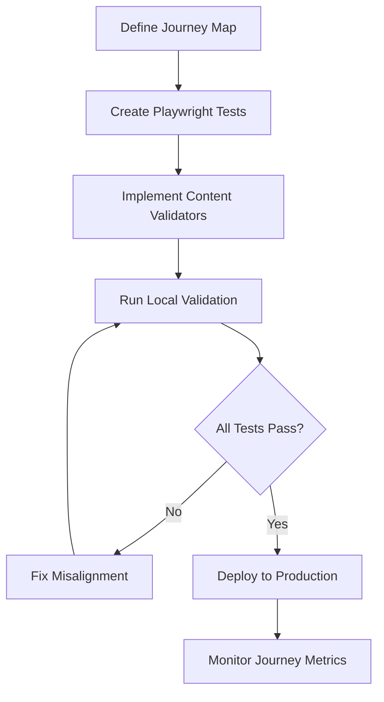

# User Journey Validation Framework

This directory contains user journey maps, validation tests, and alignment verification for the Janua Identity Platform.

## Purpose

Ensure the codebase (marketing, documentation, and functionality) accurately reflects the intended user experience across all persona journeys.

## Journey Maps

### Core Personas

1. **[Developer Integrator](./developer-integrator.md)** - Technical users integrating Janua authentication
2. **[End User](./end-user.md)** - Application users authenticating and managing their identity
3. **[Security Admin](./security-admin.md)** - Security professionals configuring and monitoring the platform
4. **[Business Decision Maker](./business-decision-maker.md)** - Stakeholders evaluating and purchasing Janua

## Validation Approach

### Local Testing
All journey validations can be run locally using Docker Compose and Playwright:

```bash
# Start local test environment
npm run test:journeys:setup

# Run all journey tests
npm run test:journeys

# Run specific persona journey
npx playwright test tests/e2e/journeys/developer-integrator.spec.ts

# Debug journey interactively
npm run test:journeys:local

# Cleanup
npm run test:journeys:teardown
```

### Content-Functionality Alignment

Journey tests validate that:
- **Marketing claims** match actual implemented features
- **Pricing tiers** reflect enforced billing limits
- **Documentation examples** actually work with current SDK versions
- **User flows** complete successfully as promised
- **Performance expectations** are met in real usage

## Journey Touchpoints

Each journey is mapped across these touchpoints:

1. **Discovery** - Marketing site, search results, referrals
2. **Evaluation** - Documentation, pricing, feature comparison
3. **Onboarding** - Signup, SDK installation, quickstart
4. **Usage** - Core workflows, feature utilization
5. **Growth** - Advanced features, scaling, enterprise

## Testing Workflow



## Journey Metrics

Track completion rates and friction points:
- Time to complete each journey stage
- Drop-off rates at critical checkpoints
- Feature discovery and utilization rates
- Support ticket correlation with journey stages

## Related Documentation

- [Testing Strategy](../technical/testing-strategy.md)
- [Content Guidelines](../CONTENT_GUIDELINES.md)
- [API Reference](../api/API_REFERENCE.md)
- [Implementation Guide](../guides/IMPLEMENTATION_GUIDE.md)
