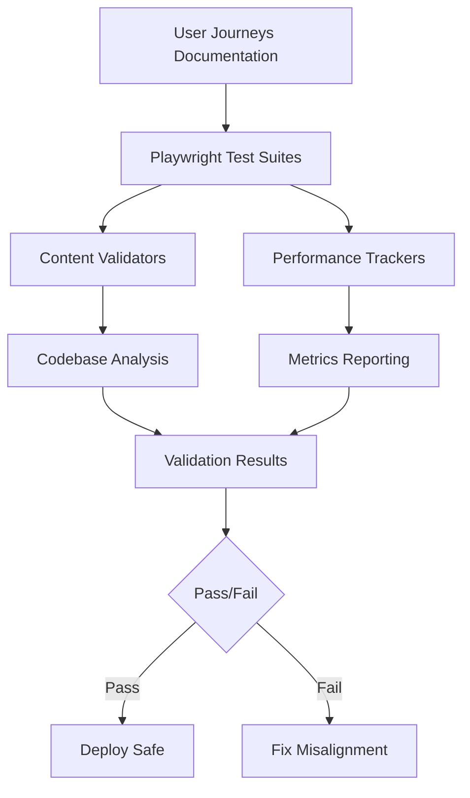

# User Journey Testing Workflow

Complete guide for validating that user experience matches marketing claims and documentation.

## Overview

The user journey validation framework ensures alignment between:
- **Marketing claims** → Actual implemented features
- **Documentation** → SDK behavior and APIs
- **Pricing tiers** → Billing service enforcement
- **Performance claims** → Measured user experience

## Quick Start

```bash
# 1. Start local test environment
npm run test:journeys:setup

# 2. Run all journey tests
npm run test:journeys

# 3. View test report
npm run test:journeys:report

# 4. Cleanup
npm run test:journeys:teardown
```

## Architecture



## Test Environment

### Services

| Service | Port | Purpose |
|---------|------|---------|
| API | 8000 | Backend authentication services |
| Landing Page | 3000 | Marketing and documentation site |
| Test App | 3001 | Sample app using Janua SDK |
| Dashboard | 3002 | Admin and user management |
| PostgreSQL | 5432 | Database |
| Redis | 6379 | Cache and sessions |

### Starting Environment

```bash
# Option 1: Docker Compose (recommended)
docker-compose -f docker-compose.test.yml up -d

# Option 2: Individual services
npm run dev:api &
npm run dev:landing &
npm run dev:test-app &
```

### Verifying Services

```bash
# Wait script checks all services
bash scripts/wait-for-services.sh

# Manual health checks
curl http://localhost:8000/health  # API
curl http://localhost:3000         # Landing
curl http://localhost:3001         # Test App
```

## Running Tests

### Local Development

```bash
# Run all journey tests with cleanup
npm run test:journeys

# Run specific journey
npx playwright test tests/e2e/journeys/developer-integrator.spec.ts

# Run with UI (debugging)
npm run test:journeys:local

# Run specific test by name
npx playwright test -g "Signup: Complete account creation"

# Run in headed mode
npx playwright test --headed

# Run with debug
npx playwright test --debug
```

### CI/CD Pipeline

```bash
# GitHub Actions automatically runs on:
# - Push to main/develop
# - PR to main/develop
# - Changes to apps/landing, apps/api, packages/, docs/user-journeys/

# Manual trigger
gh workflow run validate-user-journeys.yml

# View results
gh run list --workflow=validate-user-journeys.yml
gh run view <run-id>
```

## Journey Test Structure

### Test Organization

```
tests/e2e/
├── journeys/                    # User journey test suites
│   ├── developer-integrator.spec.ts
│   ├── end-user.spec.ts
│   ├── security-admin.spec.ts
│   └── business-decision-maker.spec.ts
├── fixtures/                    # Test data and personas
│   ├── personas.ts             # User persona factories
│   ├── test-data.ts           # Shared test data
│   └── api-clients.ts         # API interaction helpers
├── helpers/                     # Validation utilities
│   ├── content-validator.ts   # Marketing-code alignment
│   ├── journey-metrics.ts     # Performance tracking
│   ├── feature-validator.ts   # Feature implementation checks
│   └── performance-tracker.ts # Timing and benchmarks
└── pages/                       # Page object models
    ├── landing.page.ts
    ├── signup.page.ts
    ├── dashboard.page.ts
    └── admin.page.ts
```

### Writing New Journey Tests

```typescript
import { test, expect } from '@playwright/test';
import { DeveloperPersona } from '../fixtures/personas';
import { JourneyMetricsTracker } from '../helpers/journey-metrics';

test.describe('My New Journey', () => {
  
  test('Journey stage validation', async ({ page }) => {
    // 1. Setup metrics tracking
    const metrics = new JourneyMetricsTracker();
    metrics.startJourney('my-journey-stage');
    
    // 2. Create test persona
    const persona = DeveloperPersona.create();
    
    // 3. Navigate and interact
    await page.goto('http://localhost:3000/my-page');
    metrics.checkpoint('page-load');
    
    // 4. Perform actions
    await page.fill('[data-testid="input"]', 'value');
    metrics.checkpoint('form-filled');
    
    await page.click('[data-testid="submit"]');
    metrics.checkpoint('form-submitted');
    
    // 5. Assert expected outcome
    await expect(page.locator('[data-testid="success"]')).toBeVisible();
    metrics.checkpoint('success-shown');
    
    // 6. End journey and validate performance
    const result = metrics.endJourney(true);
    expect(result.totalTime).toBeLessThan(5000); // 5 seconds max
  });
});
```

## Content Validation

### Feature Claims

```typescript
import { ContentValidator } from '../helpers/content-validator';

test('Claimed features exist in codebase', async ({ page }) => {
  await page.goto('http://localhost:3000/features');
  
  const result = await ContentValidator.validateFeatureClaim(
    page,
    '[data-testid="feature-mfa"]'
  );
  
  expect(result.implemented).toBeTruthy();
  console.log(`Implementation paths: ${result.implementationPaths.join(', ')}`);
});
```

### Pricing Validation

```typescript
test('Pricing tiers match billing limits', async ({ page }) => {
  const pricingResults = await ContentValidator.validatePricingClaims(page);
  
  pricingResults.forEach(result => {
    expect(result.matches).toBeTruthy();
    console.log(`${result.tier}: ${result.claimedLimit} = ${result.actualLimit}`);
  });
});
```

### Documentation Examples

```typescript
test('Code examples compile successfully', async ({ page }) => {
  await page.goto('http://localhost:3000/docs/quickstart');
  
  const isValid = await ContentValidator.validateCodeExamples(
    page,
    '[data-testid="quickstart-code"]'
  );
  
  expect(isValid).toBeTruthy();
});
```

## Performance Validation

### Tracking Metrics

```typescript
import { JourneyMetricsTracker, PerformanceExpectations } from '../helpers/journey-metrics';

test('Signup performance meets claims', async ({ page }) => {
  const metrics = new JourneyMetricsTracker();
  metrics.startJourney('end-user-signup');
  
  await page.goto('http://localhost:3001/signup');
  metrics.checkpoint('page-load');
  
  // ... perform signup ...
  
  metrics.checkpoint('signup-complete');
  
  const result = metrics.endJourney(true);
  
  // Validate against documented expectations
  const validation = PerformanceExpectations.validate(result);
  console.log(validation.report);
  
  expect(validation.passedTotal).toBeTruthy();
});
```

### Performance Expectations

Defined in `journey-metrics.ts`:

```typescript
{
  'developer-signup': {
    total: 30000,  // 30 seconds max
    checkpoints: {
      'page-load': 3000,
      'form-submit': 5000,
      'dashboard-ready': 30000
    }
  }
}
```

## Debugging Failed Tests

### View Test Results

```bash
# HTML report
npm run test:journeys:report

# Raw test output
cat test-results/results.json

# Screenshots (on failure)
ls test-results/*/test-failed-*.png
```

### Common Failures

**Service Not Ready**
```bash
# Check service logs
docker-compose -f docker-compose.test.yml logs api
docker-compose -f docker-compose.test.yml logs landing

# Restart services
docker-compose -f docker-compose.test.yml restart
```

**Selector Not Found**
```typescript
// Debug selector
await page.pause(); // Interactive debugger
await page.screenshot({ path: 'debug.png' });

// Try alternative selectors
await page.locator('text=/signup/i').click();
await page.locator('[class*="signup"]').click();
```

**Timeout Errors**
```typescript
// Increase timeout for slow operations
await page.waitForSelector('[data-testid="element"]', { timeout: 30000 });

// Wait for network idle
await page.waitForLoadState('networkidle');
```

## Best Practices

### Test Data Management

```typescript
// ✅ Good: Use persona factories
const persona = DeveloperPersona.create();

// ❌ Bad: Hardcode test data
const email = 'test@example.com';
```

### Selectors

```typescript
// ✅ Good: Use data-testid attributes
await page.click('[data-testid="signup-button"]');

// ❌ Bad: Rely on implementation details
await page.click('.btn.btn-primary.signup');
```

### Assertions

```typescript
// ✅ Good: Specific assertions
await expect(page.locator('[data-testid="success"]')).toBeVisible();

// ❌ Bad: Generic assertions
expect(await page.content()).toContain('Success');
```

### Cleanup

```typescript
test.afterEach(async ({ page, request }) => {
  // Delete test user
  await request.delete(`/api/users?email=${persona.email}`);
  
  // Clear sessions
  await request.post('/api/sessions/clear-test');
});
```

## Maintenance

### Updating Journey Maps

When features change:

1. Update journey documentation (`docs/user-journeys/*.md`)
2. Update corresponding test suite (`tests/e2e/journeys/*.spec.ts`)
3. Run tests to verify alignment
4. Commit both documentation and tests together

### Adding New Personas

```typescript
// 1. Add persona factory
export class NewPersona {
  static create(overrides: Partial<PersonaData> = {}): PersonaData {
    return {
      email: `new-persona-${Date.now()}@example.com`,
      password: 'SecureP@ss123!',
      // ... other fields
    };
  }
}

// 2. Create journey documentation
// docs/user-journeys/new-persona.md

// 3. Create test suite
// tests/e2e/journeys/new-persona.spec.ts
```

### Performance Baseline Updates

When performance improves/degrades:

```typescript
// Update expectations in journey-metrics.ts
static readonly EXPECTATIONS = {
  'my-journey': {
    total: 20000,  // Update from 30000 to 20000
    checkpoints: {
      'page-load': 2000  // Update from 3000 to 2000
    }
  }
}
```

## Troubleshooting

### Services Won't Start

```bash
# Check Docker
docker ps
docker-compose -f docker-compose.test.yml ps

# View logs
docker-compose -f docker-compose.test.yml logs -f

# Reset environment
docker-compose -f docker-compose.test.yml down -v
docker system prune -f
npm run test:journeys:setup
```

### Tests Timing Out

```bash
# Increase wait time
export PLAYWRIGHT_TIMEOUT=60000

# Check service health manually
curl -v http://localhost:8000/health
curl -v http://localhost:3000
```

### False Positives

```typescript
// Add retry logic for flaky tests
test.describe.configure({ retries: 2 });

// Add explicit waits
await page.waitForLoadState('networkidle');
await page.waitForTimeout(1000); // Last resort
```

## Related Documentation

- [User Journey Maps](./README.md)
- [Developer Integrator Journey](./developer-integrator.md)
- [End User Journey](./end-user.md)
- [Security Admin Journey](./security-admin.md)
- [Business Decision Maker Journey](./business-decision-maker.md)
- [Playwright Configuration](../../playwright.config.ts)
- [E2E Test README](../../tests/e2e/README.md)

## Support

For issues or questions:

1. Check test output and screenshots
2. Review [Playwright documentation](https://playwright.dev/docs/intro)
3. Check journey documentation for expected behavior
4. Open issue with failed test details
