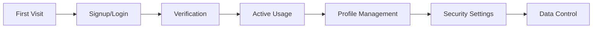

# End User Journey

**Persona**: Application users authenticating and managing their digital identity

**Primary Goal**: Securely access applications with minimal friction while maintaining control over personal data

## Journey Overview



## Stage 1: First Visit

### Touchpoints
- Client application landing page
- Authentication widget/modal
- Social login buttons
- Privacy policy link

### Goals
- Understand why authentication is needed
- Choose authentication method
- Trust the authentication provider
- Minimize friction to access content

### Expected Experience
**Authentication Interface**:
- Clear branding (client app + "Powered by Janua")
- Multiple login options (email/password, OAuth, passkey)
- Privacy-first messaging
- Accessible design (WCAG 2.1 AA compliant)

**Trust Indicators**:
- Security badges (SSL, SOC2)
- Privacy policy easily accessible
- No excessive data collection
- Transparent about data usage

### Validation Tests
```typescript
// tests/e2e/journeys/end-user.spec.ts
test('First Visit: Authentication interface is user-friendly', async ({ page }) => {
  await page.goto('http://localhost:3001/test-app');
  
  // Authentication widget should be visible
  await expect(page.locator('[data-testid="auth-widget"]')).toBeVisible();
  
  // Multiple auth methods available
  await expect(page.locator('[data-testid="email-login"]')).toBeVisible();
  await expect(page.locator('[data-testid="google-login"]')).toBeVisible();
  await expect(page.locator('[data-testid="passkey-login"]')).toBeVisible();
  
  // Privacy policy linked
  await expect(page.locator('[data-testid="privacy-policy-link"]')).toBeVisible();
});
```

## Stage 2: Signup/Login

### Touchpoints
- Signup form
- Login form
- OAuth consent screens
- WebAuthn/passkey prompts
- Password strength indicator
- Error messages

### Goals
- Create account quickly
- Choose secure but memorable credentials
- Understand what data is being collected
- Avoid common signup friction (CAPTCHA, email verification delays)

### Expected Experience
**Signup Flow**:
- Email + password OR social login
- Real-time password strength feedback
- Clear error messages (email already exists, weak password)
- Optional passkey registration for passwordless future logins
- Quick signup (<30 seconds)

**Security UX**:
- Password requirements clearly stated
- Visual password strength meter
- Suggestion for strong password
- Option to use password manager
- Passkey as simpler alternative

### Validation Tests
```typescript
test('Signup: Complete account creation successfully', async ({ page }) => {
  await page.goto('http://localhost:3001/test-app');
  
  // Click signup
  await page.click('[data-testid="signup-tab"]');
  
  // Fill signup form
  await page.fill('[data-testid="email"]', 'user@example.com');
  await page.fill('[data-testid="password"]', 'SecureUserP@ss123');
  await page.fill('[data-testid="name"]', 'Test User');
  
  // Password strength should be shown
  await expect(page.locator('[data-testid="password-strength"]')).toContainText('Strong');
  
  // Submit signup
  await page.click('[data-testid="signup-submit"]');
  
  // Should see success or verification prompt
  const successVisible = await page.locator('[data-testid="signup-success"]').isVisible();
  const verifyVisible = await page.locator('[data-testid="verify-email-prompt"]').isVisible();
  
  expect(successVisible || verifyVisible).toBeTruthy();
});

test('Login: Authenticate with existing account', async ({ page }) => {
  await page.goto('http://localhost:3001/test-app');
  
  // Fill login form
  await page.fill('[data-testid="login-email"]', 'user@example.com');
  await page.fill('[data-testid="login-password"]', 'SecureUserP@ss123');
  await page.click('[data-testid="login-submit"]');
  
  // Should be logged in
  await expect(page.locator('[data-testid="user-dashboard"]')).toBeVisible();
});
```

## Stage 3: Verification

### Touchpoints
- Email verification link
- SMS verification code (if enabled)
- In-app verification prompt
- Resend verification options

### Goals
- Verify email/phone ownership
- Avoid spam/bot accounts
- Maintain security standards
- Complete verification quickly

### Expected Experience
**Email Verification**:
- Verification email arrives within 1 minute
- Clear subject line ("Verify your email")
- Simple one-click verification
- Fallback: copy/paste verification code
- Easy resend option if email not received

**User-Friendly Process**:
- Clear instructions in app
- Status indicator (email sent, waiting for verification)
- Automatic redirect after verification
- Skip option for low-risk apps

### Validation Tests
```typescript
test('Verification: Email verification flow works', async ({ page }) => {
  // After signup, verification prompt appears
  await expect(page.locator('[data-testid="verify-email-prompt"]')).toBeVisible();
  
  // Instructions should be clear
  const instructions = await page.locator('[data-testid="verification-instructions"]').textContent();
  expect(instructions).toContain('Check your email');
  
  // Resend option available
  await expect(page.locator('[data-testid="resend-verification"]')).toBeVisible();
  
  // Simulate verification (in local testing)
  await page.goto('http://localhost:3001/verify?token=test-verification-token');
  
  // Successful verification
  await expect(page.locator('[data-testid="verification-success"]')).toBeVisible();
  
  // User should now be logged in
  await expect(page.locator('[data-testid="user-dashboard"]')).toBeVisible();
});
```

## Stage 4: Active Usage

### Touchpoints
- Application interface
- Session persistence
- Re-authentication prompts
- Password reset (if forgotten)
- Multi-device access

### Goals
- Stay logged in across sessions
- Access from multiple devices
- Recover account if password forgotten
- Seamless user experience

### Expected Experience
**Session Management**:
- "Remember me" option keeps session active
- Session persists across browser tabs
- Session expires after inactivity (30 days default)
- Clear session status indicators

**Multi-Device Support**:
- Login on mobile, desktop, tablet
- Session sync across devices
- Logout from all devices option
- Active sessions list

### Validation Tests
```typescript
test('Active Usage: Session persists across page reloads', async ({ page }) => {
  // Login
  await page.goto('http://localhost:3001/test-app');
  await page.fill('[data-testid="login-email"]', 'user@example.com');
  await page.fill('[data-testid="login-password"]', 'SecureUserP@ss123');
  await page.click('[data-testid="login-submit"]');
  
  // Confirm logged in
  await expect(page.locator('[data-testid="user-profile"]')).toBeVisible();
  
  // Reload page
  await page.reload();
  
  // Should still be logged in (session persisted)
  await expect(page.locator('[data-testid="user-profile"]')).toBeVisible();
});

test('Password Reset: Recover account access', async ({ page }) => {
  await page.goto('http://localhost:3001/test-app');
  
  // Click forgot password
  await page.click('[data-testid="forgot-password-link"]');
  
  // Enter email
  await page.fill('[data-testid="reset-email"]', 'user@example.com');
  await page.click('[data-testid="send-reset-link"]');
  
  // Confirmation shown
  await expect(page.locator('[data-testid="reset-email-sent"]')).toBeVisible();
  
  // Simulate clicking reset link (local testing)
  await page.goto('http://localhost:3001/reset-password?token=test-reset-token');
  
  // Set new password
  await page.fill('[data-testid="new-password"]', 'NewSecureP@ss456');
  await page.fill('[data-testid="confirm-password"]', 'NewSecureP@ss456');
  await page.click('[data-testid="reset-password-submit"]');
  
  // Password reset success
  await expect(page.locator('[data-testid="password-reset-success"]')).toBeVisible();
});
```

## Stage 5: Profile Management

### Touchpoints
- Profile settings page
- Email change flow
- Name/display information
- Connected accounts (OAuth)
- Account deletion

### Goals
- Update personal information
- Change email address
- Manage connected social accounts
- Control account data

### Expected Experience
**Profile Updates**:
- Easy access to settings
- Change email (with verification)
- Update name/display info
- Manage OAuth connections
- Clear save confirmation

**Data Control**:
- See what data is stored
- Export personal data (GDPR)
- Delete account option
- Clear about consequences

### Validation Tests
```typescript
test('Profile Management: Update user information', async ({ page }) => {
  // Navigate to profile settings
  await page.goto('http://localhost:3001/test-app/profile');
  
  // Update name
  await page.fill('[data-testid="display-name"]', 'Updated User Name');
  await page.click('[data-testid="save-profile"]');
  
  // Confirmation shown
  await expect(page.locator('[data-testid="profile-updated"]')).toBeVisible();
  
  // Change email
  await page.fill('[data-testid="new-email"]', 'newemail@example.com');
  await page.click('[data-testid="change-email"]');
  
  // Verification required
  await expect(page.locator('[data-testid="verify-new-email"]')).toBeVisible();
});
```

## Stage 6: Security Settings

### Touchpoints
- Security settings page
- MFA setup flow
- Passkey registration
- Active sessions list
- Security event log

### Goals
- Enable two-factor authentication
- Register passkeys for passwordless login
- Review active sessions
- Enhance account security

### Expected Experience
**MFA Setup**:
- Clear benefits explanation
- Multiple MFA options (TOTP, SMS, passkey)
- QR code for authenticator apps
- Backup codes provided
- Recovery options explained

**Passkey Registration**:
- Simple one-click setup
- Works with platform authenticators (Face ID, Windows Hello)
- No passwords to remember
- Fallback options available

### Validation Tests
```typescript
test('Security Settings: Enable MFA successfully', async ({ page }) => {
  await page.goto('http://localhost:3001/test-app/security');
  
  // Enable MFA
  await page.click('[data-testid="enable-mfa"]');
  
  // QR code shown
  await expect(page.locator('[data-testid="mfa-qr-code"]')).toBeVisible();
  
  // Enter TOTP code to verify
  await page.fill('[data-testid="mfa-verify-code"]', '123456');
  await page.click('[data-testid="verify-mfa-setup"]');
  
  // MFA enabled confirmation
  await expect(page.locator('[data-testid="mfa-enabled"]')).toBeVisible();
  
  // Backup codes provided
  await expect(page.locator('[data-testid="backup-codes"]')).toBeVisible();
});

test('Passkey Registration: Setup passwordless authentication', async ({ page }) => {
  await page.goto('http://localhost:3001/test-app/security');
  
  // Register passkey
  await page.click('[data-testid="register-passkey"]');
  
  // Platform authenticator prompt (simulated in test)
  // In real browser, this triggers WebAuthn ceremony
  
  // Passkey registered
  await expect(page.locator('[data-testid="passkey-registered"]')).toBeVisible();
  
  // Logout and test passkey login
  await page.click('[data-testid="logout"]');
  await page.click('[data-testid="passkey-login"]');
  
  // Should authenticate without password
  await expect(page.locator('[data-testid="user-dashboard"]')).toBeVisible();
});
```

## Stage 7: Data Control

### Touchpoints
- Privacy settings
- Data export
- Account deletion
- Consent management
- Privacy policy

### Goals
- Understand data usage
- Export personal data
- Delete account if desired
- Manage privacy preferences

### Expected Experience
**GDPR Compliance**:
- Easy data export (JSON format)
- Clear account deletion process
- Consent preferences manageable
- Data retention policy explained

**User Empowerment**:
- Full transparency on data collection
- Control over data sharing
- Right to be forgotten honored
- No hidden data retention

### Validation Tests
```typescript
test('Data Control: Export personal data', async ({ page }) => {
  await page.goto('http://localhost:3001/test-app/privacy');
  
  // Request data export
  await page.click('[data-testid="export-data"]');
  
  // Export initiated
  await expect(page.locator('[data-testid="export-started"]')).toBeVisible();
  
  // Download link provided (or email sent)
  const downloadLink = page.locator('[data-testid="download-data"]');
  if (await downloadLink.isVisible()) {
    // Verify download contains user data
    const [download] = await Promise.all([
      page.waitForEvent('download'),
      downloadLink.click()
    ]);
    
    expect(download.suggestedFilename()).toContain('user-data');
  }
});

test('Account Deletion: Delete account permanently', async ({ page }) => {
  await page.goto('http://localhost:3001/test-app/privacy');
  
  // Initiate account deletion
  await page.click('[data-testid="delete-account"]');
  
  // Confirmation required
  await expect(page.locator('[data-testid="delete-confirmation"]')).toBeVisible();
  
  // Explain consequences
  const warning = await page.locator('[data-testid="deletion-warning"]').textContent();
  expect(warning).toContain('permanent');
  expect(warning).toContain('cannot be recovered');
  
  // Confirm deletion
  await page.fill('[data-testid="confirm-deletion"]', 'DELETE');
  await page.click('[data-testid="confirm-delete-button"]');
  
  // Account deleted
  await expect(page.locator('[data-testid="account-deleted"]')).toBeVisible();
  
  // Try to login (should fail)
  await page.goto('http://localhost:3001/test-app');
  await page.fill('[data-testid="login-email"]', 'user@example.com');
  await page.fill('[data-testid="login-password"]', 'SecureUserP@ss123');
  await page.click('[data-testid="login-submit"]');
  
  // Login should fail
  await expect(page.locator('[data-testid="login-error"]')).toBeVisible();
});
```

## Key Performance Indicators

### Success Metrics
- **Signup Completion**: >85% of started signups complete
- **Time to First Login**: <30 seconds average
- **Session Retention**: >70% users stay logged in across visits
- **MFA Adoption**: >40% of users enable MFA
- **Support Tickets**: <2% of users need help with authentication

### Friction Points to Monitor
- Password strength requirements too strict
- Email verification delays
- Passkey setup confusion
- MFA setup abandonment
- Account recovery failures

## Journey Validation Checklist

Before deploying updates affecting end users:

- [ ] Signup flow completes successfully
- [ ] Login flow works with all methods (password, OAuth, passkey)
- [ ] Email verification delivered and functional
- [ ] Session persistence works across page reloads
- [ ] Password reset flow completes successfully
- [ ] Profile updates save correctly
- [ ] MFA setup works and challenges correctly
- [ ] Passkey registration and authentication functional
- [ ] Data export produces complete user data
- [ ] Account deletion removes all user data
- [ ] Error messages are user-friendly
- [ ] Accessibility standards met (WCAG 2.1 AA)

## Related Journeys

- **Developer Integrator**: Developers configure the authentication UX this journey validates
- **Security Admin**: Admins may need to assist users with account recovery or security issues
- **Business Decision Maker**: User experience quality influences purchase decisions
